# Customizable Holder for Remote Controls or any other stuff

by IOIO72 aka Tamio Patrick Honma (https://honma.de)

## Update

2021-11-26: Tablet to attach on top of the hooks added.

## Description

This holder was originally intended for remote controls, which you attach to the couch armrest. 

In addition, it is possible to use the holder for all sorts of other purposes. This is especially possible due to the customizability of the 3D model. For example, you can also configure a holder for tools and material of the 3D printer or something for the garden, the workshop, the garage or the household.

Ultimately, the 3D model is a box, which can be subdivided as desired, and a holding device.

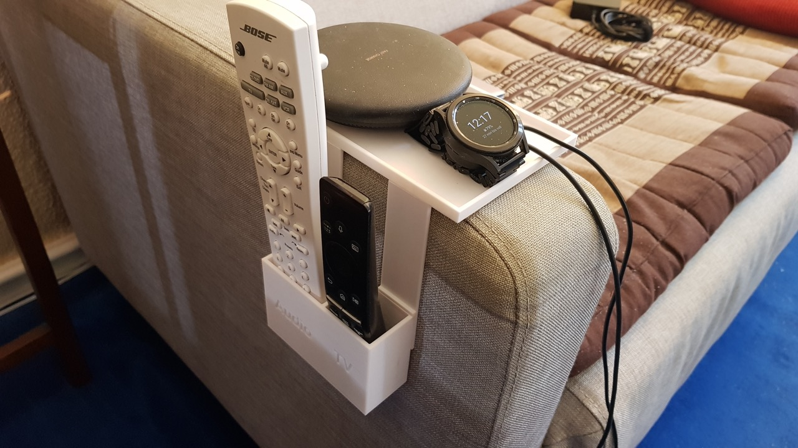
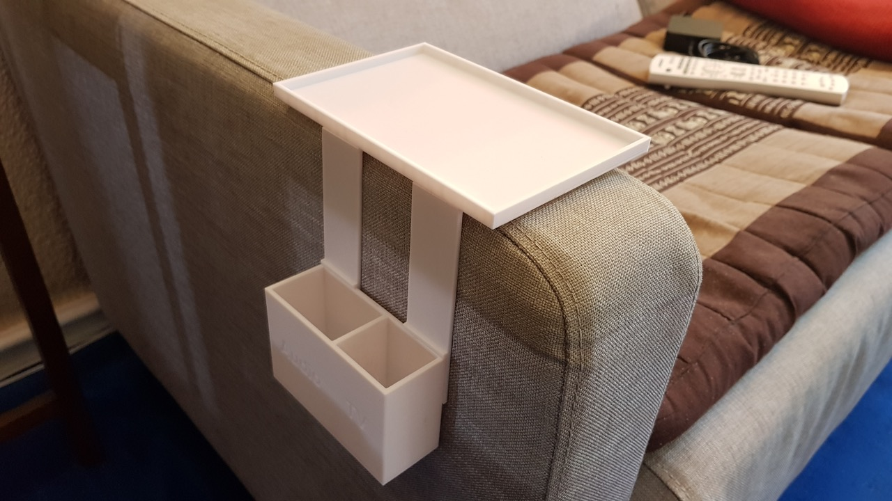
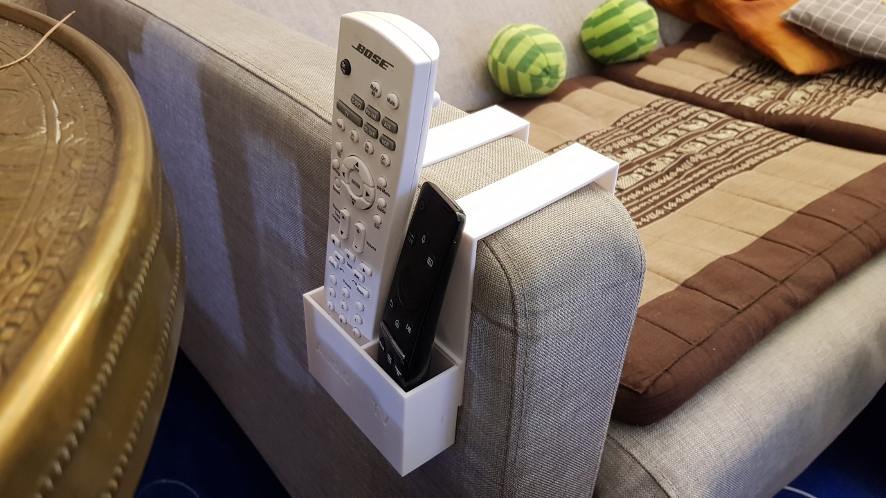
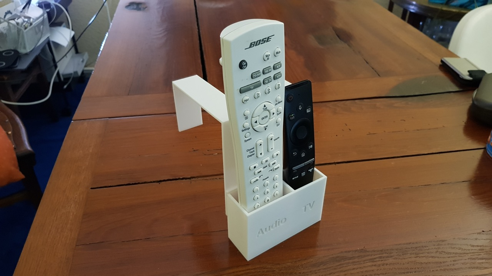
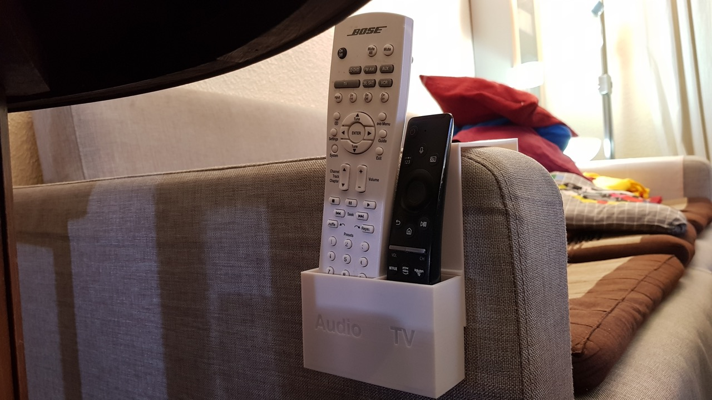
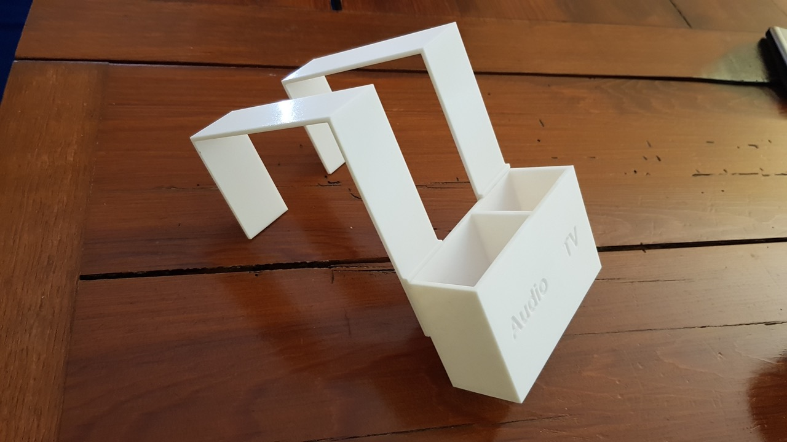
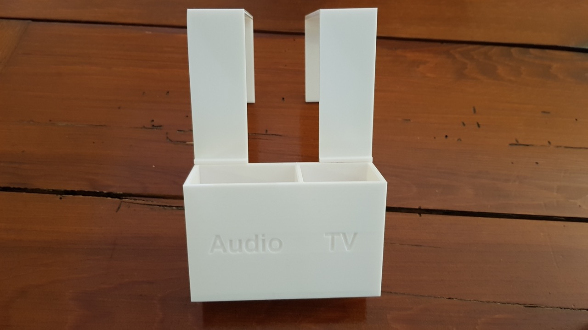
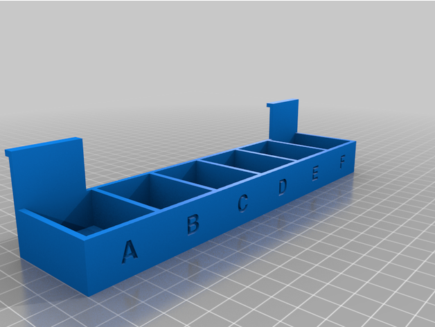
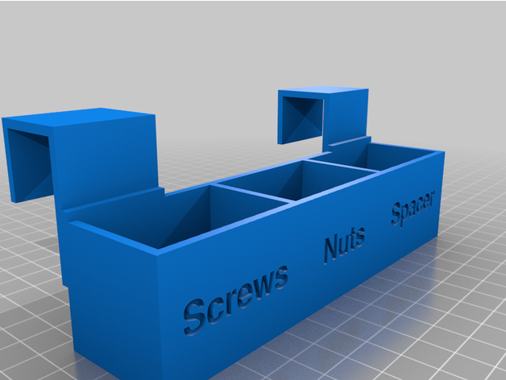
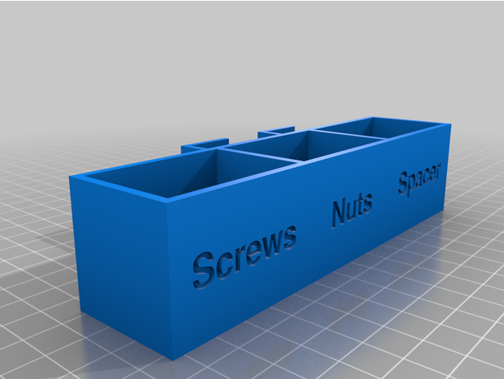
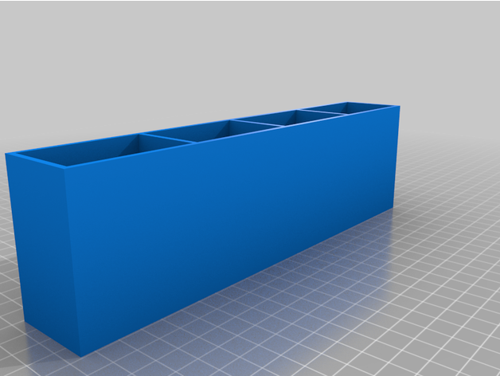

## Customize

 **How to configure the box:**

1. Set the general height and depth of the box.

2. Subdivision is done by a list of width specifications. It is important to keep the format: At the beginning and at the end of the list are square brackets and between them a comma-separated list of width specifications.

3. You can designate the individual subdivisions. The order of the entries corresponds to the list of width specifications. If you do not want any designations, enter the following there: `[""]`

4. The text size of the designations and the font used can also be set. For font selection, use the menu item "Help/ Font list" in OpenSCAD, select a font there and copy it to the clipboard. Then paste the font name into the "font" input field. It is important that you remove the quotation marks.

**How to configure the hook for attachment:**

All specifications refer to the inside of the hook, i.e. if you measure, for example, the width of your armrest, you can enter exactly this value. The walls of the hook are added around it.

1. Enter the width and height of the hook. The height is measured from the top edge of the box.
2. Enter the depth of the hook. This would be, for example, the width of your armrest.
3. Enter the height of the hook's attachment.
4. Set the type of hook. "Separate" is intended for mounting the hook to the box by glue. To make it easier to print, select "Separate printable". With the "Unibody" option, the hook becomes a part of the box. The latter can only be printed by support structures.

**How to configure the tablet for attachment on top of the hook:**

- Set the frame height of the tablet to 0, if you like to get a print tablet.
- Otherwise you can use this value to set the frame of the tablet.

**Select the parts:**

By selecting the parts, you can generate individual STL files for box and hook or generate a complete STL file for all components. This might be useful to place the parts on your print bed.

### Use OpenSCAD

1. **Download and install:** [OpenSCAD](http://openscad.org/) version 2021.01 or newer
2. **Download:** The *.scad file of this model.
3. **Start** OpenSCAD and **open** the *.scad file in it.
4. **Open the customizer** via the menu "Window/Customizer"

Now you can configure the model and use the `F5` key to render the preview of your changes.

#### Export your STL file

If you're done with your model settings, you can export the STL file:

1. Render the mesh by pressing the `F6` key.
2. Wait until the rendering is finished. This might take some minutes.
3. Export the STL file by pressing the `F7` key.

#### Optionally save your configuration

If you like to use your configuration as a template for further models, it's a good idea, to save your configuration:

1. Click the `+` symbol in the customizer, which you find beside the configuration selector drop-down in the second line of the customizer.
2. Give your configuration a name.

Use the drop-down menu to access your saved configurations.
